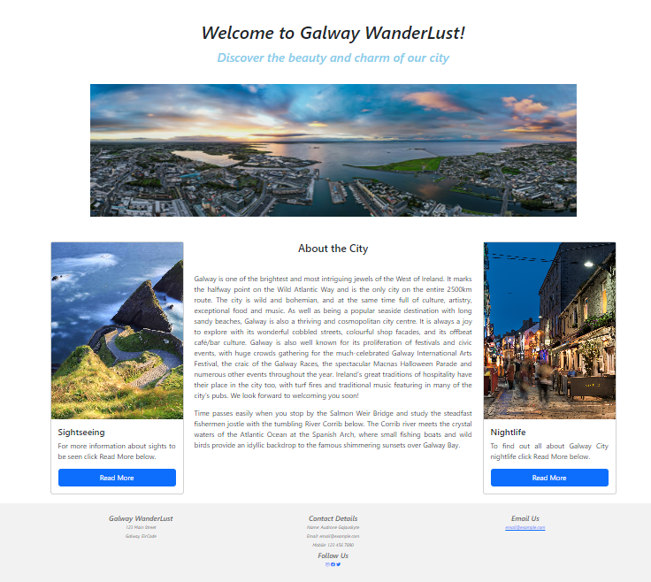
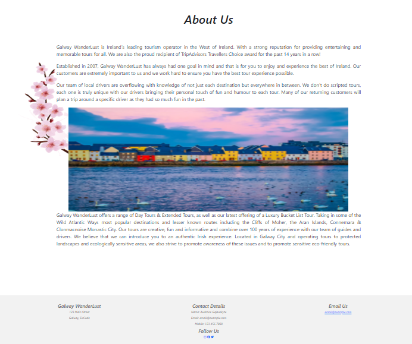
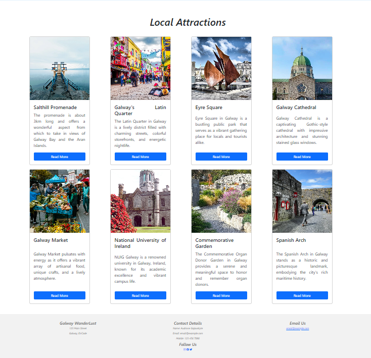
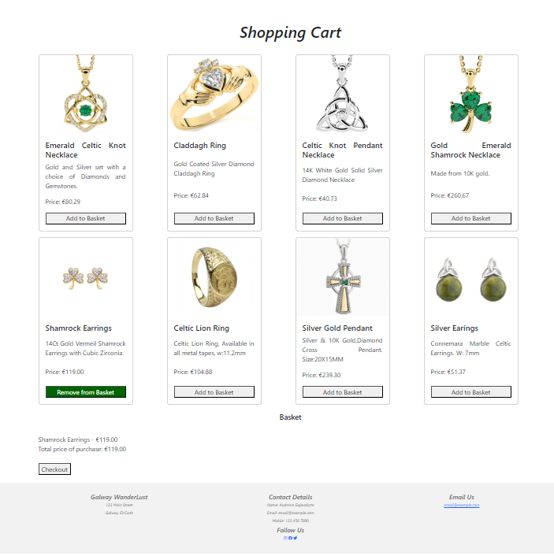

# Galway WanderLust

Galway WanderLust is a site designed to help tourists explore and discover the vibrant city of Galway, Ireland. The site provides comprehensive information about local attractions, cultural spots, and activities. It aims to be the go-to resource for tourists planning their trip to Galway, offering insights into must-visit locations, shopping options, and more.


## Features

### Existing Features

- **Navigation Bar**
  - Fully responsive navigation bar with links to Home, About Us, Contact Us, Local Attractions, and Buy Me pages.
  

- **Home Page**
  - Captivating landing page with an introduction to Galway WanderLust.
  

- **About Us Page**
  - Overview of Galway WanderLust, including history, services, and team, with supporting images.
  

- **Contact Us Page**
  - Contact form for user inquiries and contact details for Galway WanderLust.
  

- **Local Attractions Page**
  - Information cards about various attractions in Galway with images, descriptions, and links.
  

- **Shopping Cart Page (Buy Me)**
  - Displays products available for purchase with images, descriptions, prices, and 'Add to Basket' buttons.
  

### Features Left to Implement
- **User Accounts**
  - Allow users to create accounts to save favorite attractions and purchases.

## Testing
1. **Local Testing:** The website was initially developed and tested locally using a simple HTTP server to ensure all pages rendered correctly and links worked as expected.
2. **Browser Compatibility:** The site was tested on multiple browsers including Chrome, Firefox, and Edge to ensure cross-browser compatibility.
3. **Responsiveness:** Various screen sizes were tested using the browser's developer tools to ensure the website is fully responsive on mobile, tablet, and desktop devices.

### Validator Testing
- **HTML**
  - No errors were returned when passing through the official W3C validator.
- **CSS**
  - No errors were found when passing through the official (Jigsaw) validator.

### Unfixed Bugs
- No known bugs.

### Deployment

The project was deployed using GitHub Pages. The following steps outline the deployment process:

1. **Version Control:** Ensure all changes are committed and pushed to the GitHub repository.
2. **GitHub Pages Configuration:** In the GitHub repository settings, navigate to the "Pages" section and select the branch and folder (typically `main` or `master` and `/root` or `/docs`) to deploy.
3. **Build and Deploy:** GitHub Pages automatically builds and deploys the site. Check the provided URL to ensure the site is live.

## Cloning and Deployment

To clone and deploy this project for yourself, follow these steps:

### Prerequisites

- Git installed on your local machine
- A GitHub account

### Cloning the Repository

1. Open a terminal window.
2. Clone the repository using the following command:
    ```bash
    git clone https://github.com/your-username/galway-wanderlust.git
    ```
3. Navigate to the project directory:
    ```bash
    cd galway-wanderlust
    ```
## Credits

### Content
- Some text used on the website is sourced from [Galway Tourism](https://www.galwaytourism.ie/best-tours-galway/).

### Media
- All images used are from [This Open Source site](https://unsplash.com).

### Acknowledgements
- Special thanks to the Code Institute for providing the README template and guidance throughout the project.
